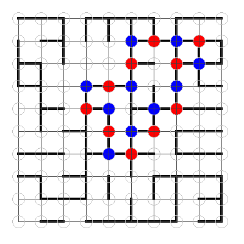

# JavaLabs Lab 6

[valid 2021-2022]
Positional Game
Consider a game played on a grid-shaped board. A grid is a two-dimensional structure of intersecting lines, the lines are evenly spaced, intersecting at right angles.
At the beginning of the game, there will be randomly placed small line-shaped tokens (sticks) that connect two adjacent intersections of the grid, along a line of the grid.
An intersection that is adjacent with at least one stick, is called a node.
The first player selects any node of the grid and places a circular-shaped token (stone) on it. Next, the players must alternatively choose a new unselected node that is adjacent (is connected by a stick) to the previously selected one and place a stone on it. They use stones of different colors. The player who cannot choose another node, loses the game.
In order to create a graphical user interface for the game, you may use either Swing or JavaFX.

Compulsory (1p)

Create the following components:

- [x]The main frame of the application.
- [x] A configuration panel for introducing parameters regarding the grid size and a button for creating a new game. The panel must be placed at the top part of the frame. The panel must contain at least one label and one input component.
- [x] A canvas (drawing panel) for drawing the board. Draw the grid lines according to the values specified in the config panel. This panel must be placed in the center part of the frame.
- [x] A control panel for managing the game. This panel will contain the buttons: Load, Save, Exit ,etc. and it will be placed at the bottom part of the frame.

Homework (2p)
- [x] Create the object oriented model.
- [x] Initialize the game by generating random sticks and place them on the board. Implement either direct or retained mode for drawing the game board.
- [x] Implement the logic of the game. When the player execute a mouse pressed operation, a stone must be drawn at the mouse location: red or blue depending on whose turn it is. Validate the move, according to the game rules. Determine the winner of the game.
- [x] (+0.5p) Export the current image of the game board into a PNG file.
- [] (+0.5p) Use object serialization in order to save and restore the current status of the game.

Output of the homework assignment, state saved as PNG: 

How to use:

Run/Double-click on Lab6.jar
