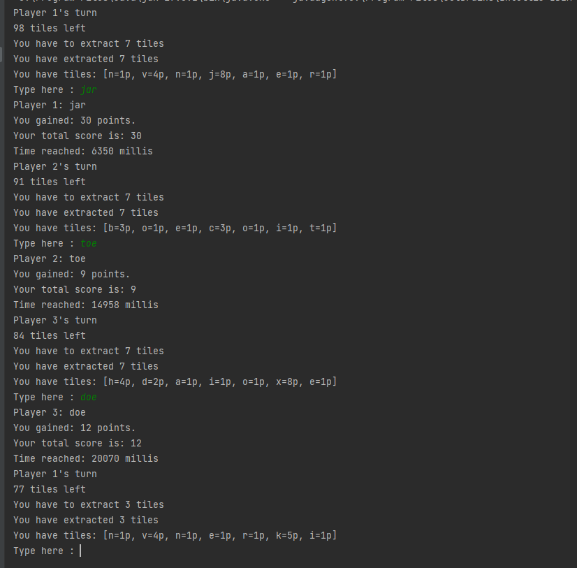

# JavaLabs Lab 7

[valid 2021-2022]
Concurrency
Write a program that simulates a word game between a given number of players.

At the beginning of the game there is a bag containing a number of tiles. Each tile represents a letter and has a number of points. The application will also use a dictionary that contains a list of acceptable words. Each player extracts 7 tiles from the bag and must create a word from the dictionary with them. When a player creates a word, it submits it to the board and receives a number of points (the value of tile points multiplied by the length of the word). After submitting a word of length k, the player will immediately request other tiles k from the bag(if this is possible). If the player cannot create a word, it will discard all the tiles and extract others (and passes its turn). The game ends when the bag becomes empty. The winner is the player with the highest score.
The players might take turns (or not...) and a time limit might be imposed (or not...).

Compulsory (1p)

Create the following components:

- [x] Create an object oriented model of the problem. You may assume that there are 10 tiles for each letter in the alphabet and each letter is worth a random number of points (between 1 and 10).
- [x] Each player will have a name and they must perform in a concurrent manner, extracting repeatedly tokens from the board.
- [x] After each extraction, the player will submit to the board all the letters.
- [x] Simulate the game using a thread for each player.
Pay attention to the synchronization of the threads when extracting tokens from the bag and when putting words on the board.

Homework (2p)
- [] Use the following number of tiles for each letter: A-9, B-2, C-2, D-4, E-12, F-2, G-3, H-2, I-9, J-1, K-1, L-4, M-2, N-6, O-8, P-2, Q-1, R-6, S-4, T-6, U-4, V-2, W-2, X-1, Y-2, Z-1
- [] Use the following points for the letters:
(1 point)-A, E, I, O, U, L, N, S, T, R
(2 points)-D, G
(3 points)-B, C, M, P
(4 points)-F, H, V, W, Y
(5 points)-K
(8 points)- J, X
(10 points)-Q, Z
- [] Create an implementation of a dictionary, using some collection of words. Use an appropriate collection to represent the dictionary. This collection should be large enough; you may use aspell to generate a text file containing English words, or anything similar: WordNet, dexonline, etc.
- [] Implement the scoring and determine who the winner is at the end of the game.
- [] Make sure that players wait their turns, using a wait-notify approach
- [] Implement a timekeeper thread that runs concurrently with the player threads, as a daemon. This thread will display the running time of the game and it will stop the game if it exceeds a certain time limit.

Bonus (2p+)

- [] The dictionay must offer the possibility to search not only for a word, but for words which start with a given prefix (lookup).
- [] Implement the prefix search (for a classical collection) using a multi-threaded approach (parallel streams, ForkJoin, etc).
- [] Represent the words in the dictionary as a prefix tree or directed acyclic word graph for memory efficiency and prefix lookups.
- [] Compare the running time for the lookup operation between a standard collection and the one above (prefix tree or dawg).

Output of the homework assignment, state saved as PNG: 

